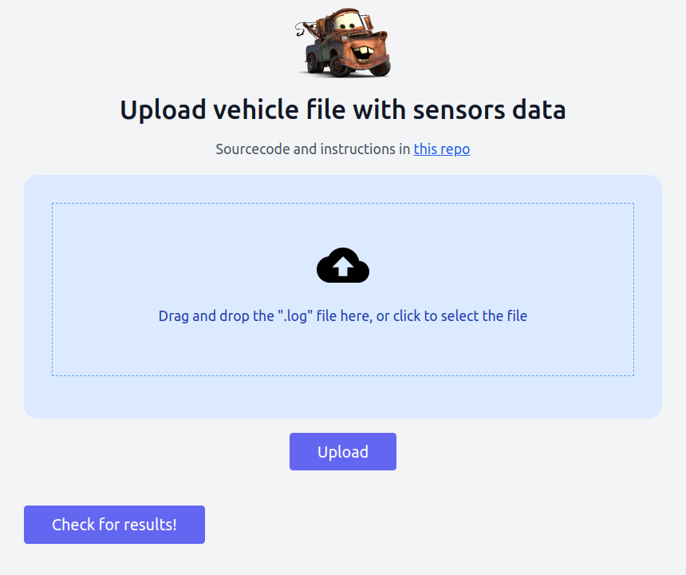

# Description

We have a fleet of vehicles equipped with sensors for `loudness`, `bumpiness`, and `happiness`. The vehicles upload a file with this format:

```text
reference loudness 5 bumpiness 10 happiness 5
loudness 184744bf-6439-4c9b-aeba-42e8fb6a214d
2007-04-05T22:00 3
2007-04-05T22:01 2
loudness f8aa668d-96b6-4f64-8179-505fa291ebd3
2007-04-05T22:00 8
2007-04-05T22:01 6
happiness 184744bf-6439-4c9b-aeba-42e8fb6a214d
2007-04-05T22:00 1
2007-04-05T22:01 2
happiness f8aa668d-96b6-4f64-8179-505fa291ebd3
2007-04-05T22:00 7
2007-04-05T22:01 9
bumpiness f8aa668d-96b6-4f64-8179-505fa291ebd3
2007-04-05T22:00 7
2007-04-05T22:01 9
```

The first line has some reference values, then for the following line, the first word is the sensor type (`loudness`, `bumpiness` or `happiness`) and the second word is the sensor `id` (in the example above `184744bf-6439-4c9b-aeba-42e8fb6a214d` and `f8aa668d-96b6-4f64-8179-505fa291ebd3`), then some timestamped values.

We have to process the file in order to classify each sensor, so for the above input we should get the following classification:

```json5
{
  "184744bf-6439-4c9b-aeba-42e8fb6a214d": [
    "loudness",
    "happiness"
  ],
  "f8aa668d-96b6-4f64-8179-505fa291ebd3": [
    "loudness",
    "happiness",
    "bumpiness"
  ]
}
```

# Demo

[Click here](https://TODO) to check the demo!

<br />
<p align="center">
    <a href="https://TODO">
        
    </a>
</p>
<br />

# Backend

In [this repo](https://github.com/s4nt14go/classify-sensors-back) you can take a look at the backend
